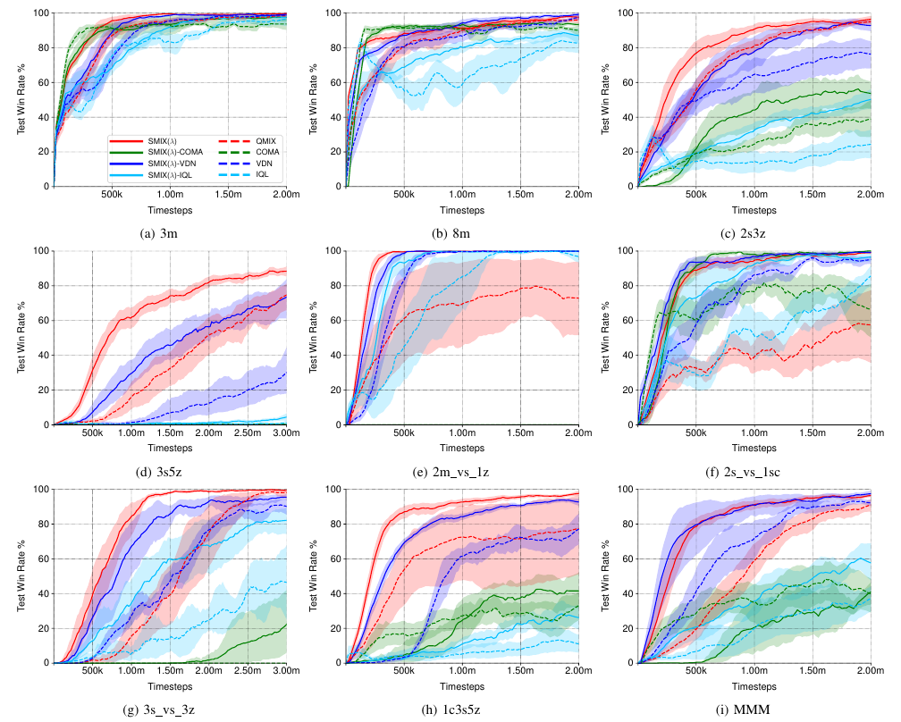

# SMIX(λ)

PyTorch implementation of "[SMIX(λ): Enhancing Centralized Value Functions for Cooperative Multi-Agent Reinforcement Learning](http://parnec.nuaa.edu.cn/xtan/paper/AAAI-WenC.2318.pdf)". If you use our code please cite the paper.


## Installation

SMIX(λ) is tested on [SMAC](https://github.com/oxwhirl/smac) environment. The installation procedure is the same as [pymarl](https://github.com/oxwhirl/pymarl).


## Run SMIX(λ)

Run SMIX(λ) on 3s5z map:

```shell
python3 src/main.py --config=smix --env-config=sc2 with env_args.map_name=3s5z
```

## Results



## Replays of SMIX(λ)

Videos of SMIX(λ)'s performance on 3s5z scenario are available respectively at: 
- <https://youtu.be/mY13RDVy-qc>
- <https://youtu.be/2Eut_y-9neQ>.

## Citing SMIX(λ) 

In BibTeX format:

```tex
@inproceedings{wen20smix,
  title={SMIX($\lambda$): Enhancing Centralized Value Functions for Cooperative Multi-Agent Reinforcement Learning},
  author={Wen, Chao and Yao, Xinghu and Wang, Yuhui and Tan, Xiaoyang},
  booktitle={Proceedings of the Thirty-Fourth AAAI Conference on Artificial Intelligence},
  year={2020},
}
```
